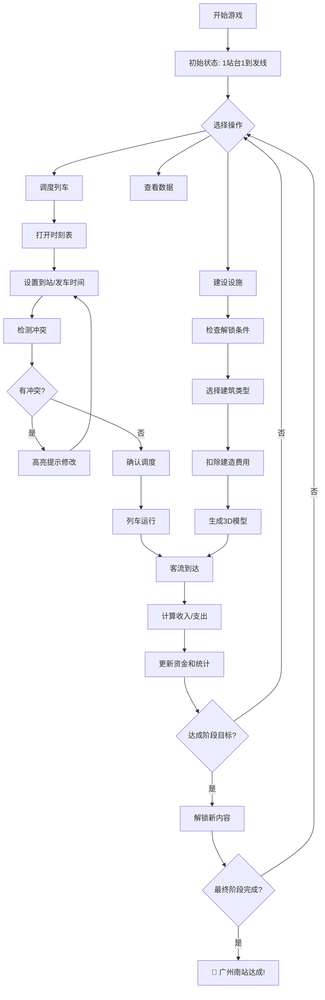
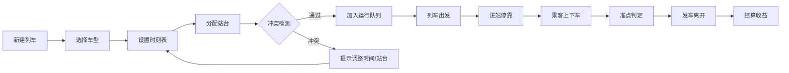

# Railway Frontier – 从乘降所到超级枢纽

## 1. 产品概述
**Railway Frontier** 是一款3D火车站模拟经营游戏，玩家从一座只有1个站台、1条到发线的乡村小站开始，通过调度列车、管理客流、投资基础设施，逐步扩建到多站台、多线路、多层换乘的现代化特等站（以广州南站为终极目标）。

- **核心玩法**：手动时刻表调度 + 站台建设解锁 + 客流收入经营
- **目标用户**：模拟经营游戏爱好者、铁路迷、策略游戏玩家
- **市场价值**：填补国内3D铁路经营游戏的空白，结合真实中国高铁发展历程

## 2. 核心功能

### 2.1 用户角色
| 角色 | 操作方式 | 核心权限 |
|------|---------|---------|
| 站长（玩家） | 鼠标+键盘 | 调度列车、建设设施、查看数据、管理资金 |

### 2.2 功能模块
1. **主游戏场景**：3D车站俯视图、站台/列车/人流可视化、天气日夜系统
2. **调度面板**：甘特图时刻表、冲突检测、列车状态监控
3. **建设系统**：站台/通道/商业设施解锁与建造
4. **数据看板**：实时资金/客流/准率率、历史趋势图表
5. **阶段任务**：6个发展阶段 + 彩蛋任务系统

### 2.3 页面功能详情
| 模块名称 | 子模块 | 功能描述 |
|----------|--------|----------|
| **3D场景** | 站台渲染 | 低多边形风格站台模型（长方体+顶棚），支持点击交互 |
| | 列车动画 | 4种车型（普速/快速/动车/高铁），沿轨道运行动画 |
| | 人流粒子 | 乘客用粒子群表示，沿通道移动，超过500人自动合并优化 |
| | 天气系统 | 晴天/小雨/暴雨/雪天4种效果，影响客流量系数 |
| | 日夜循环 | 24分钟现实时间=24游戏小时，夜间灯光自动开启 |
| **调度系统** | 时刻表编辑 | 为每列车设定到站/发车时间、停靠站台，甘特图展示 |
| | 冲突检测 | 同一到发线间隔≥3分钟，冲突项高亮提示 |
| | 准点计算 | 晚点≥2分钟扣10%收入，≥5分钟扣30%并降低1小时客流 |
| **建设系统** | 站台解锁 | 6个阶段逐步解锁1-8号站台，条件为累计收入达标 |
| | 通道建造 | 5种通道类型（斑马线/天桥/地下通道/自动步道/商业大厅） |
| | 商业设施 | 报刊亭/快餐店/广告牌，提供额外收入来源 |
| **经营系统** | 收入结算 | 客流量×票价+衍生收入，每游戏分钟结算一次 |
| | 支出项目 | 列车维护/保洁/员工工资/设施维护费 |
| | 信誉系统 | 晚点降低信誉，最多影响70%客流 |
| **数据看板** | 右上角面板 | 资金/总收入/客流/准点率/日期时间/天气图标 |
| | 热力图 | 站台颜色深浅表示拥堵程度（红色=超容量排队） |
| | 历史图表 | 最近60分钟资金/客流/准点率趋势折线图 |
| **任务系统** | 阶段目标 | 5个主要阶段目标（日客流500→解锁广州南站称号） |
| | 彩蛋任务 | 特殊挑战（如暴雨期间零摔倒、接待10列重联动车组） |

## 3. 核心流程

### 3.1 游戏主流程

### 3.2 列车调度流程

## 4. 用户界面设计

### 4.1 设计风格
- **视觉风格**：低多边形（Low-Poly）3D，参照《运输大亨》但立体化
- **主色调**：
  - 站台：混凝土灰 #95A5A6 + 安全黄 #F39C12
  - 高铁列车：流线白 #ECF0F1 + 动感红 #E74C3C
  - UI面板：深蓝灰 #2C3E50 + 透明玻璃态
  - 强调色：成功绿 #27AE60、警告橙 #F39C12、危险红 #E74C3C
- **字体**：数字使用等宽字体 JetBrains Mono，中文使用思源黑体
- **布局**：桌面端主场景居中，四周悬浮UI面板；移动端底部工具栏
- **图标风格**：线性图标，铁路主题（列车/站台/时钟/图表）

### 4.2 界面布局设计
| 区域 | UI元素 | 样式说明 |
|------|--------|----------|
| **顶部栏** | 游戏时间/日期/天气/倍速控制 | 半透明黑底白字，固定高度50px |
| **右上角** | 资金/收入/客流/准点率卡片 | 玻璃态面板，实时数字跳动动画 |
| **左侧栏** | 建设按钮列表 | 垂直图标按钮，未解锁灰色锁定态 |
| **右侧栏** | 数据看板/列车列表 | 可折叠面板，标签页切换 |
| **底部栏** | 阶段进度条/任务提示 | 进度条+文字描述，完成任务弹出奖励通知 |
| **中央弹窗** | 调度面板/建设详情 | 模态框，暗色背景遮罩 |

### 4.3 交互设计
- **相机控制**：鼠标右键拖拽旋转，中键滚轮缩放，WASD微调
- **点击交互**：点击站台→弹出调度面板，点击空地→建设模式
- **快捷键**：V切换视角，Space暂停，1-4切换倍速，Ctrl+Z撤销
- **反馈动效**：收入增加时数字上浮绿色，支出时红色闪烁

### 4.4 响应式设计
- **优先平台**：PC浏览器（桌面优先）
- **分辨率适配**：1920x1080为主，支持1366x768至4K
- **触摸支持**：移动端触摸拖拽旋转，双指缩放（可选）

### 4.5 3D场景设计指南
- **环境氛围**：清新明亮的小镇车站→繁华现代的超级枢纽
- **光照设置**：
  - 日间：平行光模拟阳光 + 环境光补光
  - 夜间：聚光灯模拟站台照明 + 列车头灯点光源
- **相机参数**：
  - 默认：正交相机，俯视45°角，可视范围200x200（随扩建扩大）
  - 第一人称（V键）：透视相机，轨道旁漫游
- **构图焦点**：中央站台区域，动态元素（列车/人流）吸引视线
- **交互动画**：列车进出站平滑移动，人流粒子流动，天气粒子效果
- **后期处理**：可选Bloom效果（夜景灯光）、色彩分级
- **性能预算**：
  - 面数：<10,000 triangles（低多边形）
  - 绘制调用：<100 draw calls
  - 粒子上限：500个独立实体，超出合并为粒子群
  - 帧率目标：60fps（降级至30fps）

## 5. 游戏平衡性设计

### 5.1 经济模型参数
| 项目 | 数值 |
|------|------|
| 初始资金 | 2000 |
| 普速票价 | 10元 |
| 快速票价 | 20元 |
| 动车票价 | 35元 |
| 高铁票价 | 50元 |
| 基础客流系数 | 0.5（随总收入增长至5.0） |
| 日间加成 | ×1.2 (06:00-20:00) |
| 夜间衰减 | ×0.5 (20:00-06:00) |

### 5.2 解锁里程碑
| 阶段 | 条件 | 新增内容 |
|------|------|----------|
| 1 | 初始 | 1站台+1线，人工售票，地面横道 |
| 2 | 累计收入5000 | 2站台，自动售票机，简易天桥 |
| 3 | 累计收入20000 | 3-4站台，地下通道，小型商店(+5%) |
| 4 | 累计收入80000 | 5-6站台，高架候车室，电梯，大型商业(+15%) |
| 5 | 累计收入250000 | 7-8站台，多线并行，换乘大厅，地铁接驳 |
| 6 | 彩蛋：准点率>98%持续7天 | 樱花站台皮肤/旅游专列(+5%) |

## 6. 技术约束
- **单文件部署**：所有代码打包在单个HTML文件中，可直接浏览器打开
- **无外部依赖**：除Three.js CDN外，不依赖其他库文件
- **兼容性**：支持Chrome/Firefox/Edge最新版本，需WebGL支持
- **存档功能**：使用localStorage保存游戏进度（可选IndexedDB）
