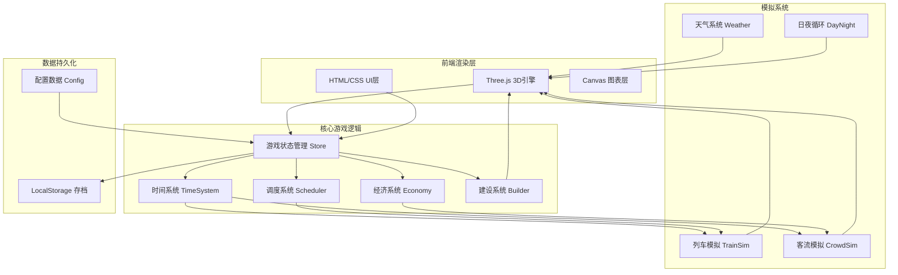

# Railway Frontier 技术架构文档

## 1. 架构设计

### 1.1 系统架构图


### 1.2 模块职责划分
| 模块 | 职责 | 关键类/函数 |
|------|------|-------------|
| **Game** | 游戏主入口，初始化所有系统，主循环 | `class Game` |
| **Renderer** | Three.js场景管理、相机控制、渲染循环 | `class Renderer` |
| **TimeSystem** | 游戏时钟、倍速控制、日夜计算 | `class TimeSystem` |
| **StationManager** | 站台/通道/设施的数据与3D模型管理 | `class StationManager` |
| **TrainScheduler** | 时刻表管理、冲突检测、准点计算 | `class TrainScheduler` |
| **TrainSystem** | 列车实体创建、移动动画、状态机 | `class TrainSystem` |
| **CrowdSystem** | 乘客生成、路径寻路、粒子渲染 | `class CrowdSystem` |
| **EconomySystem** | 收入支出结算、资金管理、信誉系统 | `class EconomySystem` |
| **WeatherSystem** | 天气状态切换、粒子效果、系数影响 | `class WeatherSystem` |
| **UIManager** | HTML面板创建、事件绑定、数据更新 | `class UIManager` |
| **DataManager** | 配置加载、存档读写、初始数据 | `class DataManager` |

## 2. 技术选型

### 2.1 技术栈详情
| 类别 | 技术 | 版本 | 用途 |
|------|------|------|------|
| **3D引擎** | Three.js | r128+ (CDN) | 场景渲染、模型创建、动画 |
| **UI框架** | 原生 HTML/CSS | - | 面板、按钮、图表容器 |
| **脚本语言** | JavaScript ES6+ | - | 游戏逻辑、状态管理 |
| **图表库** | Chart.js | 3.x (CDN) | 数据看板趋势图（可选） |
| **构建方式** | 单HTML文件 | - | 内嵌CSS/JS，无需构建工具 |
| **数据存储** | LocalStorage | - | 游戏存档保存 |

### 2.2 为什么选择这个技术栈
- **Three.js**：WebGL标准库，社区成熟，适合低多边形风格，支持正交/透视相机切换
- **原生JS**：无框架开销，单文件部署方便，性能可控
- **单HTML文件**：用户可直接双击运行，零配置门槛
- **CDN引入**：Three.js从cdn.jsdelivr.net加载，无需本地依赖

## 3. 文件结构（单文件内部组织）

```html
<!DOCTYPE html>
<html>
<head>
    <!-- 元信息、样式 -->
    <style>
        /* 1. CSS变量定义 */
        /* 2. 重置样式 */
        /* 3. 布局系统 */
        /* 4. 组件样式 */
        /* 5. 动画关键帧 */
        /* 6. 响应式媒体查询 */
    </style>
</head>
<body>
    <!-- UI 层 -->
    <div id="ui-layer">
        <!-- 顶部栏：时间/天气/倍速 -->
        <!-- 右上角：资金/统计卡片 -->
        <!-- 左侧：建设面板 -->
        <!-- 右侧：数据看板 -->
        <!-- 底部：任务进度 -->
        <!-- 模态框：调度面板/建设详情 -->
    </div>
    
    <!-- 3D 画布容器 -->
    <div id="canvas-container"></div>
    
    <!-- 脚本 -->
    <script src="https://cdn.jsdelivr.net/npm/three@0.128.0/build/three.min.js"></script>
    <script>
        // ============================================
        // 1. 配置常量 CONFIG
        // ============================================
        
        // ============================================
        // 2. 工具函数 UTILS
        // ============================================
        
        // ============================================
        // 3. 数据模型 MODELS
        // ============================================
        
        // ============================================
        // 4. 核心系统 SYSTEMS
        //    - TimeSystem
        //    - StationManager
        //    - TrainScheduler
        //    - TrainSystem
        //    - CrowdSystem
        //    - EconomySystem
        //    - WeatherSystem
        // ============================================
        
        // ============================================
        // 5. 渲染器 RENDERER
        // ============================================
        
        // ============================================
        // 6. UI管理器 UI_MANAGER
        // ============================================
        
        // ============================================
        // 7. 主游戏类 GAME
        // ============================================
        
        // ============================================
        // 8. 启动入口 INIT
        // ============================================
    </script>
</body>
</html>
```

## 4. 核心数据结构

### 4.1 游戏全局状态 (GameState)
```javascript
const gameState = {
    // 基础资源
    money: 2000,                    // 当前资金
    totalIncome: 0,                 // 累计收入（用于解锁判断）
    reputation: 100,                // 信誉值 (0-100)
    
    // 时间状态
    gameTime: {                     // 游戏时间
        hour: 8,
        minute: 0,
        day: 1
    },
    timeSpeed: 1,                   // 时间倍速 (1/2/4)
    isPaused: false,
    
    // 车站数据
    platforms: [],                  // 站台数组 [Platform]
    tracks: [],                     // 到发线数组 [Track]
    passages: [],                   // 通道数组 [Passage]
    buildings: [],                  // 商业设施数组 [Building]
    
    // 列车数据
    trains: [],                     // 列车实例数组 [Train]
    schedule: [],                   // 时刻表 [ScheduleItem]
    
    // 统计数据
    stats: {
        currentPassengers: 0,       // 当前客流/分钟
        onTimeRate: 100,            // 准点率 (%)
        dailyPassengerCount: 0,     // 今日累计客流
        trainsLateCount: 0,         // 今日晚点次数
        history: []                 // 历史记录 [{time, money, passengers, onTimeRate}]
    },
    
    // 解锁状态
    unlockedStages: 1,              // 当前阶段 (1-6)
    unlockedPlatforms: 1,           // 已解锁站台数
    unlockedPassages: ['crosswalk'],// 已解锁通道类型
    
    // 天气与时间
    weather: 'sunny',               // 当前天气
    isDaytime: true,                // 是否白天
    
    // 任务状态
    activeQuests: [],               // 进行中的任务
    completedQuests: [],            // 已完成任务
    achievements: []                // 已获得成就
};
```

### 4.2 站台数据模型 (Platform)
```javascript
class Platform {
    constructor(id, position) {
        this.id = id;                           // 站台编号 (1-8)
        this.position = { x, z };               // 3D坐标
        this.tracks = [];                       // 到发线列表 [Track]
        this.capacity = 100;                    // 容量
        this.currentLoad = 0;                   // 当前负载
        this.hasRoof = false;                   // 是否有雨棚
        this.level = 1;                         // 等级 (地面/高架)
        this.unlockedAtStage = 1;               // 解锁阶段
        this.mesh = null;                        // Three.js网格引用
    }
}
```

### 4.3 列车数据模型 (Train)
```javascript
class Train {
    constructor(id, type) {
        this.id = id;                           // 列车编号
        this.type = type;                       // 类型: normal/fast/bullet/highspeed
        this.speed = this.getSpeedByType();     // 速度等级
        this.ticketPrice = this.getPriceByType(); // 票价
        
        this.state = 'waiting';                 // 状态: waiting/running/stopped/late
        this.currentTrack = null;               // 当前轨道
        this.targetPlatform = null;             // 目标站台
        this.position = { x, z };               // 当前位置
        this.progress = 0;                      // 进度 (0-1)
        
        this.schedule = {
            arrivalTime: null,                   // 计划到站时间 {hour, minute}
            departureTime: null,                 // 计划发车时间 {hour, minute}
            actualArrival: null,                 // 实际到站时间
            actualDeparture: null,               // 实际发车时间
            delayMinutes: 0                      // 晚点分钟数
        };
        
        this.passengers = 0;                     // 载客量
        this.mesh = null;                        // 3D模型引用
    }
}
```

### 4.4 时刻表项 (ScheduleItem)
```javascript
{
    trainId: string,
    platformId: number,
    trackId: number,
    arrivalTime: { hour, minute },       // 到站时间
    departureTime: { hour, minute },     // 发车时间
    status: 'scheduled' | 'conflict' | 'completed' | 'late',
    conflictWith: []                     // 冲突的调度项ID列表
}
```

### 4.5 通道数据模型 (Passage)
```javascript
class Passage {
    constructor(id, type, fromPlatform, toPlatform) {
        this.id = id;
        this.type = type;                     // crosswalk/bridge/tunnel/movingWalk/commercialHall
        this.fromPlatform = fromPlatform;      // 起始站台
        this.toPlatform = toPlatform;          // 目标站台
        this.capacity = this.getCapacity();    // 容量 (人/分钟)
        this.speed = this.getSpeed();          // 通行速度
        this.cost = this.getCost();            // 建造成本
        this.maintenanceCost = this.getMaintenanceCost(); // 维护费/分钟
        this.currentUsage = 0;                 // 当前使用人数
        this.mesh = null;                       // 3D模型
    }
}
```

## 5. 核心算法设计

### 5.1 时间系统算法
```javascript
class TimeSystem {
    constructor() {
        this.gameTime = { hour: 8, minute: 0, day: 1 };
        this.speed = 1;          // 1x, 2x, 4x
        this.lastUpdate = Date.now();
    }
    
    update(deltaTime) {
        // 1秒现实时间 = 1分钟游戏时间 × 倍速
        const gameMinutesPassed = (deltaTime / 1000) * this.speed;
        
        this.gameTime.minute += gameMinutesPassed;
        
        // 时间进位处理
        while (this.gameTime.minute >= 60) {
            this.gameTime.minute -= 60;
            this.gameTime.hour++;
        }
        while (this.gameTime.hour >= 24) {
            this.gameTime.hour -= 24;
            this.gameTime.day++;
            this.onNewDay();   // 触发新日事件
        }
    }
    
    getDayPhase() {
        const h = this.gameTime.hour;
        if (h >= 6 && h < 20) return 'day';    // 日间
        return 'night';                          // 夜间
    }
    
    getTimeString() {
        return `${String(this.gameTime.hour).padStart(2,'0')}:${String(Math.floor(this.gameTime.minute)).padStart(2,'0')}`;
    }
}
```

### 5.2 冲突检测算法
```javascript
function detectConflicts(schedule) {
    const conflicts = [];
    
    // 按轨道分组
    const byTrack = groupBy(schedule, 'trackId');
    
    for (const [trackId, items] of Object.entries(byTrack)) {
        // 按到站时间排序
        items.sort((a, b) => timeToMinutes(a.arrivalTime) - timeToMinutes(b.arrivalTime));
        
        for (let i = 0; i < items.length; i++) {
            for (let j = i + 1; j < items.length; j++) {
                const current = items[i];
                const next = items[j];
                
                const currentDeparture = timeToMinutes(current.departureTime);
                const nextArrival = timeToMinutes(next.arrivalTime);
                
                // 检查间隔是否 ≥ 3分钟
                if (nextArrival - currentDeparture < 3) {
                    conflicts.push({
                        item1: current.id,
                        item2: next.id,
                        trackId: trackId,
                        gap: nextArrival - currentDeparture
                    });
                    
                    current.status = 'conflict';
                    current.conflictWith.push(next.id);
                    next.status = 'conflict';
                    next.conflictWith.push(current.id);
                }
            }
        }
    }
    
    return conflicts;
}

function timeToMinutes(time) {
    return time.hour * 60 + time.minute;
}
```

### 5.3 客流计算公式
```javascript
function calculatePassengers(gameState) {
    const { platforms, tracks, schedule, stats, weather, gameTime } = gameState;
    
    // 基础客流量
    const baseFlow = 
        platforms.length *           // 当前站台数
        tracks.length *              // 到发线数
        getTrainDensity(schedule) *  // 列车密度系数 (每小时到发列车数 / 10)
        getCityFactor(gameState.totalIncome); // 城市发展因子 (0.5 → 5.0)
    
    // 修正系数
    const dayBonus = isDaytime(gameTime) ? 1.2 : 0.5;
    const onTimeFactor = Math.max(0.3, stats.onTimeRate / 100);  // 准点系数
    const weatherFactor = getWeatherFactor(weather);              // 天气系数
    const passageFactor = getPassageComfortFactor(gameState.passages); // 通道舒适度
    const reputationFactor = Math.max(0.3, gameState.reputation / 100); // 信誉影响
    
    // 最终乘车人数
    const actualPassengers = Math.floor(
        baseFlow * dayBonus * onTimeFactor * weatherFactor * passageFactor * reputationFactor
    );
    
    return actualPassengers;
}
```

### 5.4 收入结算逻辑
```javascript
function calculateIncome(gameState, passengers) {
    let totalIncome = 0;
    
    // 1. 票务收入
    gameState.trains.forEach(train => {
        if (train.state === 'stopped' || train.state === 'departing') {
            totalIncome += train.passengers * train.ticketPrice;
        }
    });
    
    // 2. 衍生收入（商业设施）
    gameState.buildings.forEach(building => {
        switch (building.type) {
            case 'kiosk':
                totalIncome += passengers * 0.02;         // 报刊亭
                break;
            case 'fastfood':
                totalIncome += passengers * 0.05 + 20;    // 快餐店
                break;
            case 'advertisement':
                totalIncome += passengers * 0.01;         // 广告牌
                gameState.reputation = Math.max(0, gameState.reputation - 0.001); // 降低满意度
                break;
        }
    });
    
    // 3. 准点奖励（连续5天>95%）
    if (checkOnTimeStreak(gameState)) {
        totalIncome *= 1.1;  // 次日客流+10%
    }
    
    return Math.floor(totalIncome);
}

function calculateExpenses(gameState) {
    let expenses = 0;
    
    // 1. 列车维护费
    gameState.trains.forEach(train => {
        const speedCost = getSpeedLevel(train.type) * 0.5;
        const mileageCost = train.mileage * 0.02;
        expenses += speedCost + mileageCost;
    });
    
    // 2. 设施维护费
    gameState.passages.forEach(passage => {
        expenses += passage.maintenanceCost;
    });
    
    // 3. 员工工资（简化为固定值）
    expenses += gameState.platforms.length * 2;  // 每个站台2元/分钟
    
    return Math.floor(expenses);
}
```

### 5.5 人流粒子系统优化
```javascript
class CrowdSystem {
    constructor(scene, maxParticles = 500) {
        this.scene = scene;
        this.maxParticles = maxParticles;
        this.particles = [];
        this.groupedMode = false;  // 是否启用群组模式
        
        // 预创建粒子池
        this.initParticlePool();
    }
    
    update(passengerCount) {
        if (passengerCount > this.maxParticles && !this.groupedMode) {
            this.switchToGroupedMode();
        } else if (passengerCount <= this.maxParticles && this.groupedMode) {
            this.switchToIndividualMode();
        }
        
        if (this.groupedMode) {
            this.updateGroupedParticles(passengerCount);
        } else {
            this.updateIndividualParticles(passengerCount);
        }
    }
    
    switchToGroupedMode() {
        this.groupedMode = true;
        // 隐藏个体粒子，显示群组表示（如半透明云团）
        this.particles.forEach(p => p.mesh.visible = false);
        this.createGroupCloud();
    }
}
```

## 6. 3D场景构建规范

### 6.1 几何体组合规则
```javascript
// 站台模型 = 底座长方体 + 顶棚长方体 + 安全黄线 + 站名牌
function createPlatformMesh(platform) {
    const group = new THREE.Group();
    
    // 1. 站台主体 (混凝土灰)
    const bodyGeo = new THREE.BoxGeometry(40, 1, 8);
    const bodyMat = new THREE.MeshLambertMaterial({ color: 0x95A5A6 });
    const body = new THREE.Mesh(bodyGeo, bodyMat);
    body.position.y = 0.5;
    group.add(body);
    
    // 2. 顶棚 (深灰金属)
    const roofGeo = new THREE.BoxGeometry(42, 0.3, 10);
    const roofMat = new THREE.MeshLambertMaterial({ color: 0x7F8C8D });
    const roof = new THREE.Mesh(roofGeo, roofMat);
    roof.position.y = 4;
    group.add(roof);
    
    // 3. 支撑柱子
    for (let x = -18; x <= 18; x += 12) {
        const pillarGeo = new THREE.BoxGeometry(0.5, 3.5, 0.5);
        const pillar = new THREE.Mesh(pillarGeo, roofMat);
        pillar.position.set(x, 2, 0);
        group.add(pillar);
    }
    
    // 4. 安全黄线
    const lineGeo = new THREE.BoxGeometry(38, 0.05, 0.3);
    const lineMat = new THREE.MeshBasicMaterial({ color: 0xF39C12 });
    const line = new THREE.Mesh(lineGeo, lineMat);
    line.position.set(0, 1.01, 3.5);
    group.add(line);
    
    // 5. 站名牌
    const signGeo = new THREE.BoxGeometry(6, 1.5, 0.2);
    const signMat = new THREE.MeshLambertMaterial({ color: 0xECF0F1 });
    const sign = new THREE.Mesh(signGeo, signMat);
    sign.position.set(0, 3, 5);
    group.add(sign);
    
    return group;
}

// 列车模型 = 车头(锥体) + 车厢(多个长方体) + 车窗(透明面)
function createTrainMesh(trainType) {
    const group = new THREE.Group();
    const colors = {
        normal: 0x27AE60,      // 普速：绿色
        fast: 0x3498DB,        // 快速：蓝色
        bullet: 0xE74C3C,      // 动车：红色
        highspeed: 0xECF0F1     // 高铁：白色流线型
    };
    
    const mainColor = colors[trainType];
    
    // 车头 (流线型)
    const noseGeo = new THREE.ConeGeometry(1.5, 4, 8);
    noseGeo.rotateZ(-Math.PI / 2);
    const noseMat = new THREE.MeshPhongMaterial({ color: mainColor, shininess: 100 });
    const nose = new THREE.Mesh(noseGeo, noseMat);
    nose.position.set(2, 1.5, 0);
    group.add(nose);
    
    // 车厢 (根据车型数量不同)
    const carCount = { normal: 3, fast: 4, bullet: 6, highspeed: 8 }[trainType];
    for (let i = 0; i < carCount; i++) {
        const carGeo = new THREE.BoxGeometry(8, 3, 2.8);
        const car = new THREE.Mesh(carGeo, noseMat);
        car.position.set(-4 - i * 8.5, 1.5, 0);
        group.add(car);
        
        // 车窗
        const windowGeo = new THREE.BoxGeometry(7, 1.2, 0.1);
        const windowMat = new THREE.MeshBasicMaterial({ 
            color: 0xAED6F1, 
            transparent: true, 
            opacity: 0.6 
        });
        const window_ = new THREE.Mesh(windowGeo, windowMat);
        window_.position.set(-4 - i * 8.5, 2.2, 1.45);
        group.add(window_);
    }
    
    return group;
}
```

### 6.2 相机控制系统
```javascript
class CameraController {
    constructor(camera, domElement) {
        this.camera = camera;
        this.domElement = domElement;
        this.mode = 'orthographic';  // 'orthographic' | 'perspective' | 'fps'
        
        // 正交相机参数
        this.orthoSize = 150;        // 可视范围
        this.minOrthoSize = 50;
        this.maxOrthoSize = 500;
        
        // 旋转角度
        this.theta = Math.PI / 4;    // 水平旋转
        this.phi = Math.PI / 4;      // 垂直倾斜
        this.target = new THREE.Vector3(0, 0, 0);
        
        // 边界限制
        this.bounds = { minX: -100, maxX: 100, minZ: -100, maxZ: 100 };
        
        this.bindEvents();
    }
    
    update() {
        if (this.mode === 'orthographic') {
            const offset = new THREE.Vector3(
                Math.sin(this.phi) * Math.cos(this.theta),
                Math.cos(this.phi),
                Math.sin(this.phi) * Math.sin(this.theta)
            );
            
            this.camera.position.copy(this.target).add(offset.multiplyScalar(this.orthoSize));
            this.camera.lookAt(this.target);
            
            // 更新正交相机的可视范围
            const aspect = window.innerWidth / window.innerHeight;
            this.camera.left = -this.orthoSize * aspect;
            this.camera.right = this.orthoSize * aspect;
            this.camera.top = this.orthoSize;
            this.camera.bottom = -this.orthoSize;
            this.camera.updateProjectionMatrix();
        }
    }
    
    onMouseWheel(event) {
        event.preventDefault();
        const delta = event.deltaY > 0 ? 1.1 : 0.9;
        this.orthoSize = Math.min(this.maxOrthoSize, Math.max(this.minOrthoSize, this.orthoSize * delta));
    }
    
    onDrag(deltaX, deltaY) {
        this.theta -= deltaX * 0.01;
        this.phi = Math.max(0.1, Math.min(Math.PI / 2 - 0.1, this.phi + deltaY * 0.01));
    }
}
```

## 7. 性能优化策略

### 7.1 渲染优化
- **实例化渲染**：乘客粒子使用 `THREE.InstancedMesh` 批量绘制
- **视锥剔除**：启用Three.js自动剔除屏幕外物体
- **LOD细节层次**：远距离站台降低多边形数量
- **合并几何体**：静态物体（站台、轨道）合并为单一BufferGeometry
- **纹理图集**：将小图标合并为一张SpriteSheet减少draw calls

### 7.2 逻辑优化
- **空间划分**：使用网格划分检测碰撞，避免O(n²)
- **对象池**：预创建可复用的粒子/动画对象
- **节流更新**：UI面板每500ms更新一次，非每帧更新
- **Web Worker**：将复杂计算（冲突检测）放入Worker线程（可选）

### 7.3 内存管理
- **及时销毁**：拆除建筑时dispose材质和几何体
- **缓存机制**：相同类型站台共享geometry和material引用
- **垃圾回收**：定期清理不再使用的临时对象

## 8. 测试策略

### 8.1 功能测试要点
- [ ] 时间系统：倍速正确性、日夜切换时机
- [ ] 调度系统：冲突检测准确性、边界条件（跨午夜）
- [ ] 经济系统：收入支出计算精度、负资金处理
- [ ] 解锁系统：阶段触发条件、彩蛋任务完成判定
- [ ] 存档功能：localStorage读写、数据完整性

### 8.2 性能测试目标
- [ ] 500+粒子保持60fps
- [ ] 8个站台+20列火车同时运行流畅
- [ ] 内存占用<200MB（Chrome任务管理器）
- [ ] 首次加载时间<3秒（含CDN资源）

## 9. 部署方案

### 9.1 本地运行
1. 双击HTML文件直接在浏览器打开
2. 或使用 `python -m http.server` 启动本地服务器后访问

### 9.2 在线部署
- 上传至GitHub Pages / Netlify / Vercel等静态托管服务
- 无需后端服务器，纯前端运行

### 9.3 CDN依赖
```html
<!-- Three.js r128 -->
<script src="https://cdn.jsdelivr.net/npm/three@0.128.0/build/three.min.js"></script>

<!-- Chart.js 3.x (可选，用于图表) -->
<script src="https://cdn.jsdelivr.net/npm/chart.js@3.7.0/dist/chart.min.js"></script>
```
